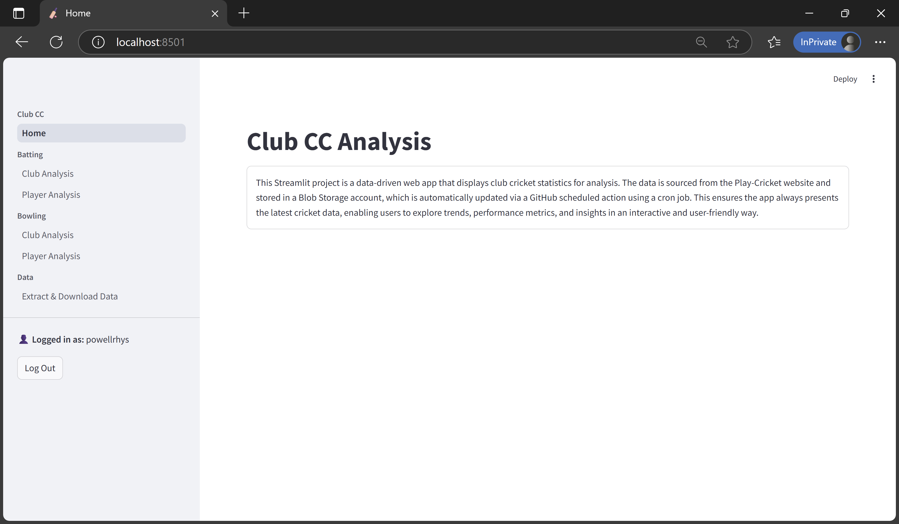
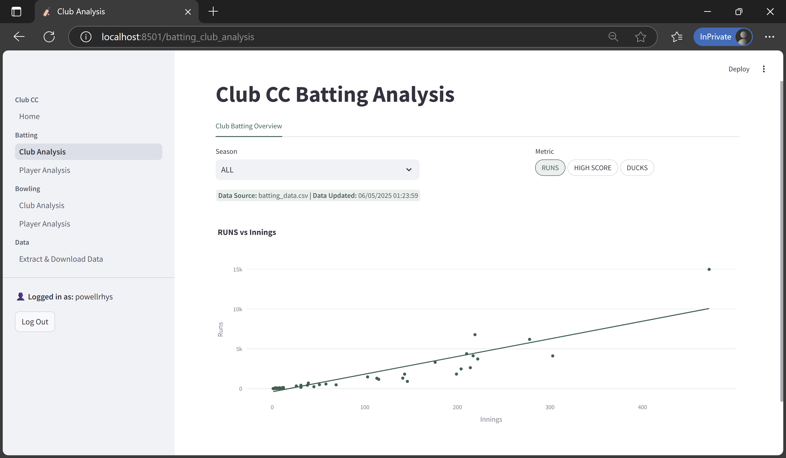
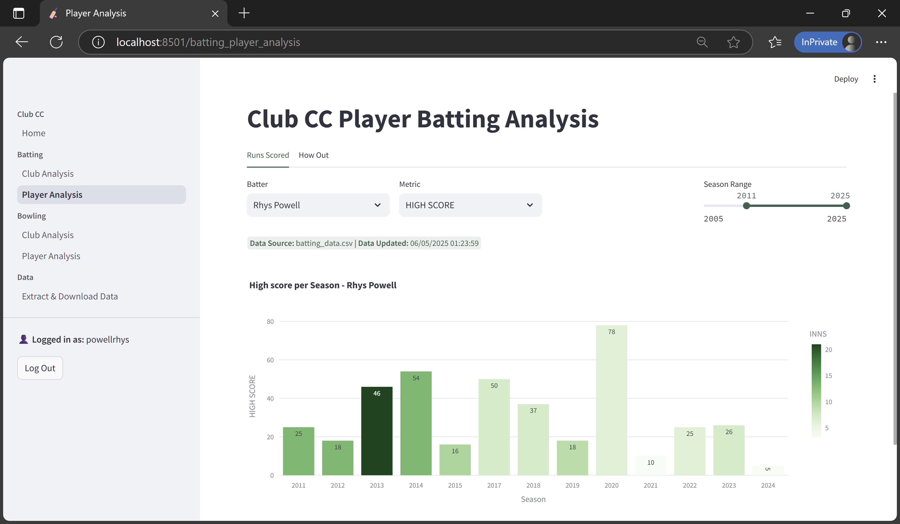
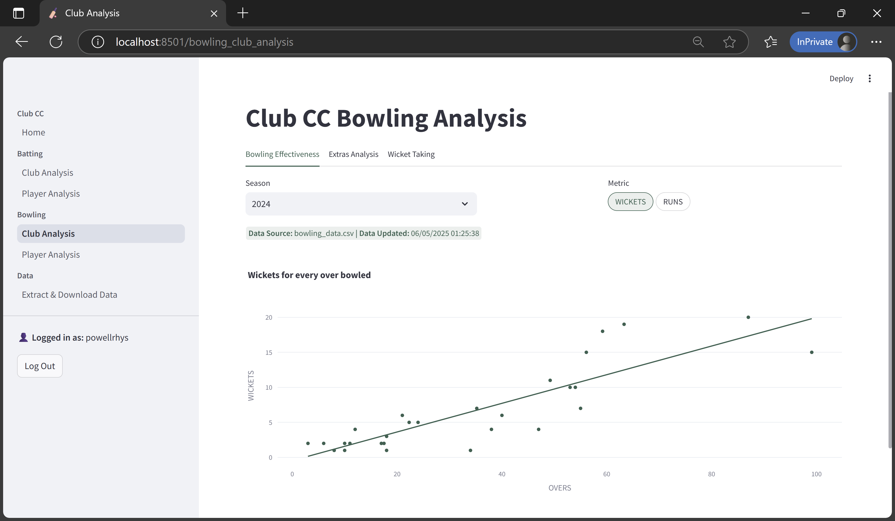
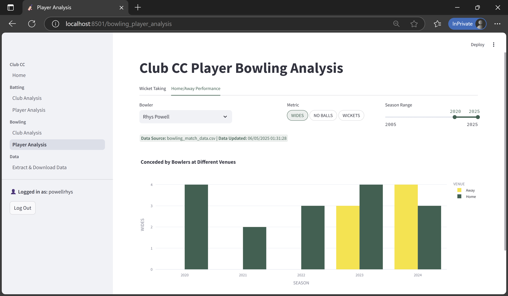
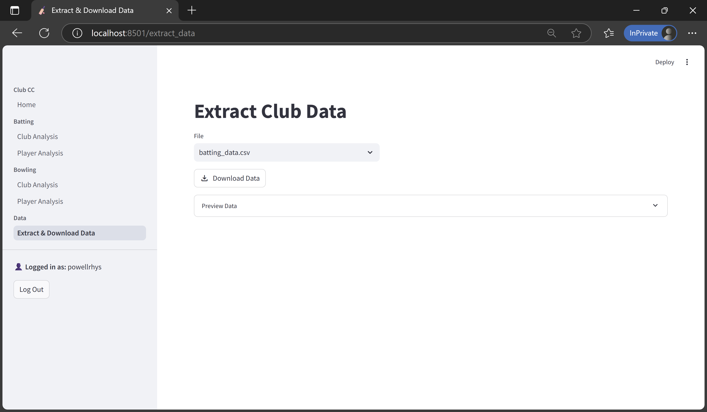

# play-cricket

### Project Codebase


### Project GitHub Action Pipelines


### Codebase Coverage

[](https://codecov.io/gh/powellrhys/golf-ui-streamlit)


### Codebase Structure

```
golf-ui-streamlit
├── .github
│   └── workflows
├── backend
│   ├── functions
├── frontend
│   ├── functions
│   └── pages
├── infra
└── tests
    ├── features
    └── unit_tests
```


## Overview

**play-cricket** is a full-stack, data-driven web application that collects, processes, and visualizes cricket performance statistics for the club’s 1st and 2nd XI across the past ten seasons.

- Automatically scrapes match data from the **Play Cricket API**  
- Weekly data ingestion via a scheduled **GitHub Actions** workflow  
- Stores processed datasets in **Azure Blob Storage**  
- Interactive **Streamlit** UI for batting, bowling, and data extraction  
- Application access restricted and authenticated through **Auth0**  

## Backend

- Python-based backend for scraping and transforming historical and recent match data  
- Integrates with Play Cricket endpoints to gather club and player statistics  
- Weekly ETL pipeline coordinated via `collect_data.yml` GitHub Action  
- Outputs stored in Azure Blob Storage for consumption by the frontend  

## Frontend

- Implemented in **Streamlit** for fast and interactive analytics dashboards  
- Loads all datasets directly from Azure Blob Storage  
- Includes six pages covering club-level and player-level batting and bowling performance, plus data extraction tools  

## Infrastructure

- **Terraform** used for Infrastructure-as-Code, stored in the `infra/` directory  
- Azure services include:  
  - Blob Storage (data)  
  - App Service (frontend hosting)  
- Fully reproducible deployment and environment setup  

## Deployment

The application is deployed in two environments:

- [Azure App Service Deployment](https://play-cricket-streamlit-frontend.azurewebsites.net/)

- [Streamlit Cloud Deployment](https://play-cricket-creigiaucc.streamlit.app/)

Both deployments require authentication via **Auth0**, due to the sensitive nature of the underlying data.

## Frontend Application

### Home Page


### Batting Club Analysis


### Batting Player Analysis


### Bowling Club Analysis


### Bowling Player Analysis


### Extract Data Page



